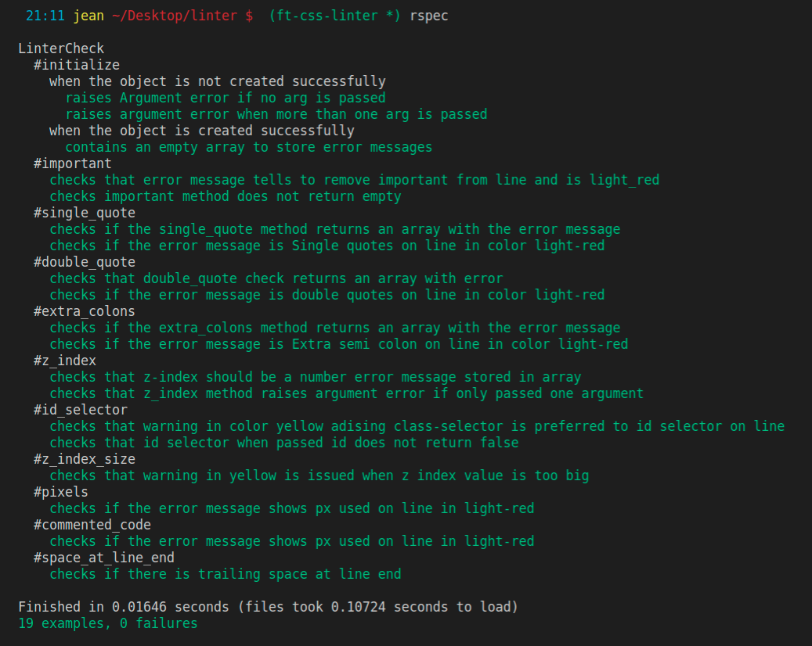
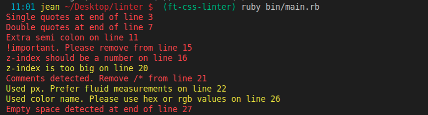
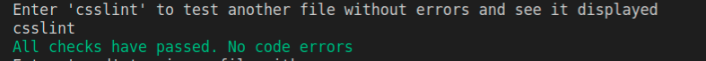
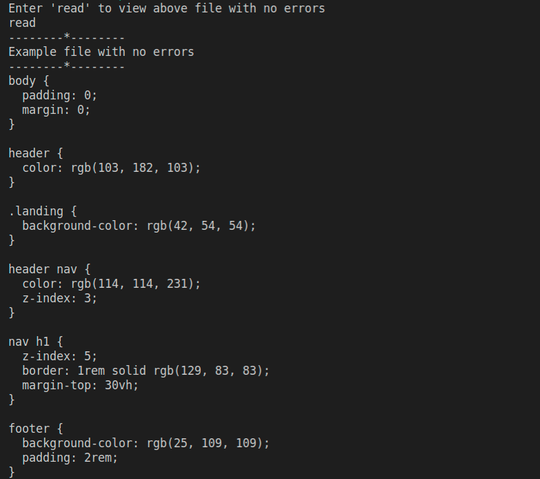
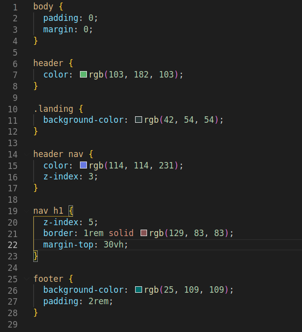
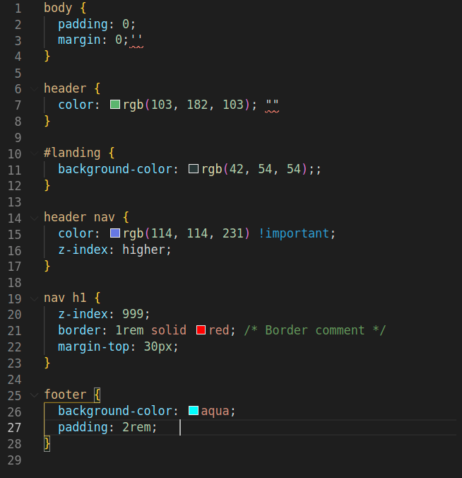

 

# CSS-linter
A CSS linter to check for custom warnings and common errors teams face during development.


## Built With
- Ruby


### Prerequisites
- A computer with ruby installed.

### set up 
```
git clone https://github.com/KabohaJeanMark/linter/
cd linter
bin/main.rb
```

### Testing
- Rspec is used to run the tests checking both negative and positive edge cases for the public methods in the LinterCheck class.
- Change directory into the main project directory and run the rspec command.
```
cd linter
rspec

```


### Usage
- git clone this repo to your local machine and navigate (cd ) to the top directory containing the main.rb file
- run the following command
```
ruby bin/main.rb
```

- It shows all of the linter checks being executed on a file.



- The user is then prompted to check another file by typing in 'csslint'

```
csslint
```



- The user is prompted to input 'read' to view a file with no errors
```
read
```


## Rules
This table shows the different CSS files side by side showing the errors and how to easily prevent making the same mistakes with a fun spot the difference game :)


| CSS file without errors | CSS file with errors |
|:---:|:---:|
|  | |


## Author

👤 **Kaboha Jean Mark**

- GitHub: [@githubhandle](https://github.com/KabohaJeanMark)
- LinkedIn: [LinkedIn](https://www.linkedin.com/in/jean-mark-kaboha-software-engineer/)

## 🤝 Contributing

Contributions, issues, and feature requests are welcome!

Feel free to check the [issues page](https://github.com/KabohaJeanMark/linter/issues).

## Show your support

Give a ⭐️ if you like this project!

## Acknowledgments

- Hat tip to Microverse.

## 📝 License

This project is [MIT](./LICENSE) licensed.
